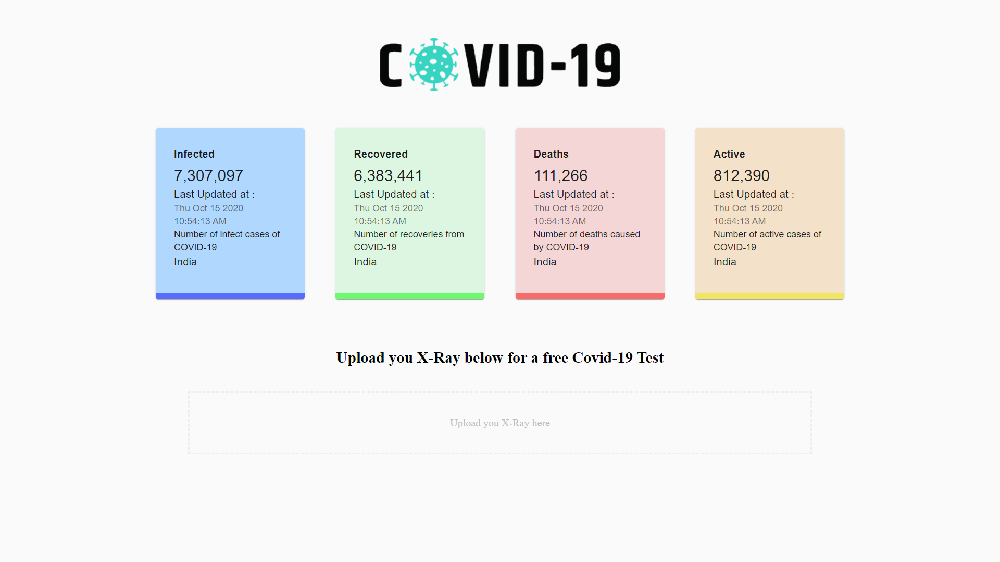

# COVID-19 Tracker (Major Project)

This Application aims to show the numbers & trends of people affected, recovered and deceased due to COVID-19 in India and perform Covid tests by analysing X-Ray Reports.


## Screenshots




## Technologies used 🛠️

- [React](https://es.reactjs.org/) - Front-End JavaScript library
- [Material UI](https://material-ui.com/) - React UI Framework
- [react-chartjs-2](https://github.com/jerairrest/react-chartjs-2) - HTML5 Charts
- [Axios](https://github.com/axios/axios) - Promise based HTTP client


## Prerequisites 📋

```
node@v10.16.0 or higher
npm@6.9.0 or higher
git@2.17.1 or higher
```

## Setup

To setup the app for development on your local machine, please follow the instructions below:

1. Clone the repo to your machine

```bash
git clone https://github.com/JaiParakh/Covid-19-Detection.git
```

2. Install necessary packages

```bash
npm install
```

3. Start the development environment

```bash
npm start
```

4. Visit http://localhost:3000


## Data Source

[Mathroid](https://covid19.mathdro.id/api/)


## Contributors

- [Jai Parakh](https://www.linkedin.com/in/jai-parakh-5626b4178/)
- [Megha Goel](https://github.com/meghagoel211)
- [Rohan Mukhija](https://github.com/rohanmukhija/)